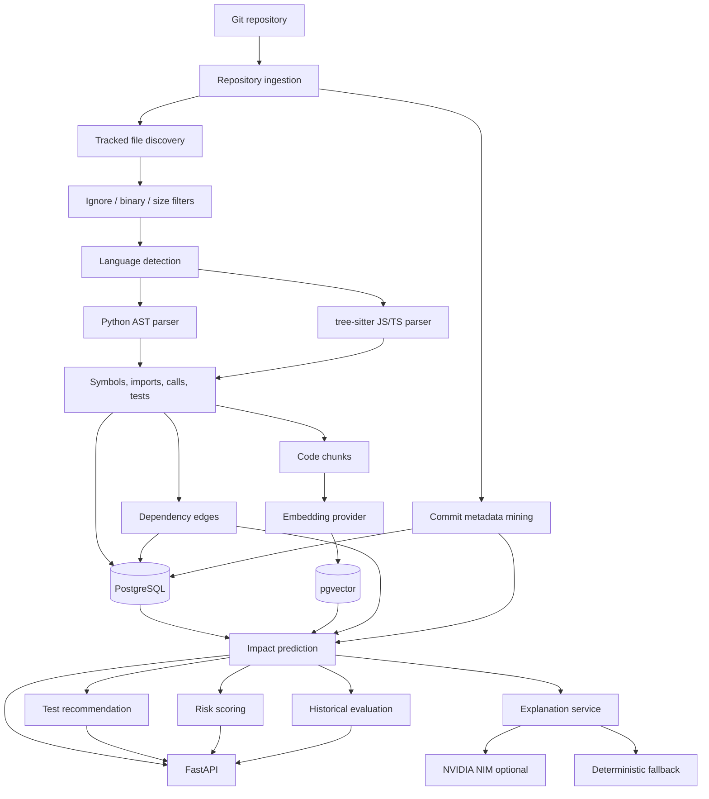

# Architecture

RepoLens is a backend-first system for explainable change impact analysis. It
uses deterministic repository analysis as the source of truth, with optional LLM
summaries layered on top.

## System Diagram

## Data Flow

1. A repository is registered from a clone URL or a local path inside
   `REPOLENS_WORKSPACE`.
2. GitPython lists tracked files and recent commits.
3. File filters remove ignored, generated, binary, oversized, and unsupported
   files.
4. Python files are parsed with `ast`; JavaScript and TypeScript files are
   parsed with `tree-sitter`.
5. Parsed imports, symbols, calls, exports, and test signals are saved.
6. Code chunks are generated from functions/classes/methods or whole files.
7. Embeddings are generated by the local sentence-transformer provider by
   default, with NVIDIA NIM embeddings available as an optional provider.
8. Dependency edges are persisted as file-level graph rows.
9. Impact analysis combines dependency, semantic, co-change, test, and risk
   evidence into ranked predictions.
10. Explanations summarize computed evidence; they do not create scores.
11. Historical evaluation compares predictions against files that actually
   changed together in stored commit metadata.

## Deterministic Components

The following systems compute evidence and scores:

- repository ingestion and Git diff parsing
- language-aware parsing
- import resolution
- dependency graph traversal
- pgvector semantic similarity
- commit co-change mining
- test mapping from imports, naming, proximity, semantic similarity, and history
- risk scoring from fan-in, fan-out, centrality, churn, complexity, file size,
  bugfix frequency, and test proximity
- ranking metrics for evaluation

These are the only sources used for impact scores.

## LLM Component

The LLM layer receives structured JSON evidence after predictions are computed.
Its prompt explicitly forbids inventing files, tests, dependencies, or certainty.
If NVIDIA NIM is disabled, missing a key, or unavailable, RepoLens returns a
deterministic fallback explanation.

LLM output is never fed back into scoring or ranking.

## Persistence Model

The core database tables are:

- `repositories`
- `commits`
- `code_files`
- `symbols`
- `dependency_edges`
- `code_chunks`
- `code_embeddings`
- `analysis_runs`
- `impact_predictions`
- `evaluation_runs`
- `evaluation_results`

Embeddings use a pgvector column with the configured dimension.

## Security Boundaries

- Repository paths must stay inside `REPOLENS_WORKSPACE`.
- RepoLens does not execute repository code.
- RepoLens recommends tests but does not run them.
- Secrets are read from environment variables and are not logged intentionally.
- Parser failures are captured as metadata instead of crashing the whole index.

## Current Limitations

- Symbol resolution is best-effort.
- JavaScript/TypeScript path aliases are limited.
- Historical evaluation uses the current index approximation.
- Background worker scaffolding exists, but indexing/evaluation currently run
  synchronously through API calls.
