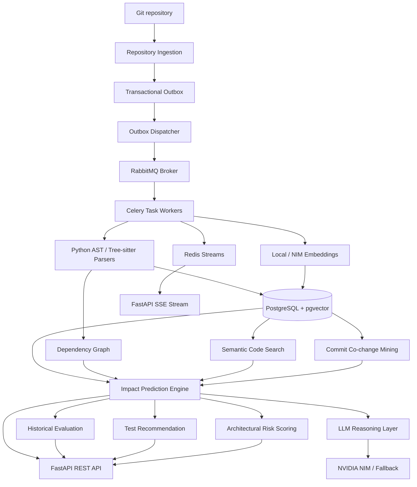

# Architecture

GitVane is a backend-first system for explainable change impact analysis. It
uses deterministic repository analysis as the source of truth, with optional LLM
summaries layered on top.

## System Diagram

## Data Flow & Generation Pipeline

1. **Repository Registration & Ingestion**:
   A repository is registered from a remote Git URL with branch selection and optional PAT authentication.
2. **Transactional Outbox & Generation State Machine**:
   An immutable `IndexGeneration` record is created in `queued` state, and an `OutboxEvent` is committed in the same database transaction.
3. **Asynchronous Dispatching & Processing**:
   The standalone `dispatcher` process picks up pending outbox events and publishes Celery tasks to RabbitMQ.
4. **Parsing & Symbol Extraction**:
   CPU workers discover tracked files, filter out binaries/generated code, and parse Python (via `ast`) and JavaScript/TypeScript (via `tree-sitter`). Parsed symbols, imports, calls, and test blocks are saved.
5. **Distributed Embedding Generation**:
   Code chunks are partitioned into `EmbeddingBatch` records. Celery workers generate embeddings (using local sentence-transformers or NVIDIA NIM) and insert them into pgvector.
6. **Real-time Progress Streaming**:
   Worker tasks publish structured progress events to Redis Streams, which FastAPI streams to clients via Server-Sent Events (SSE).
7. **Atomic Activation**:
   Once all batches complete, the repository's `active_generation_id` is updated atomically to point to the new generation.
8. **Impact & Risk Computation**:
   Impact analysis combines dependency graph traversal, semantic vector similarity, co-change frequency, test mappings, and file risk metrics into ranked predictions.
9. **Explainable Reasoning**:
   The LLM layer summarizes already-computed structured evidence without inventing files or modifying scores. If LLM services are disabled, deterministic fallback text is generated.
10. **Historical Evaluation**:
    Historical benchmarks evaluate prediction quality (Precision, Recall, MRR, MAP, NDCG) against past multi-file Git commits.

## Deterministic Components

The following systems compute evidence and scores:

- Repository ingestion and Git diff parsing
- Language-aware AST and tree-sitter parsing
- Import resolution and call graph construction
- Dependency graph traversal
- pgvector cosine similarity search
- Commit co-change frequency mining
- Test mapping from imports, naming patterns, directory proximity, and semantic similarity
- Architectural risk scoring from fan-in, fan-out, centrality, churn, complexity, file size, bugfix frequency, and test proximity
- Information retrieval evaluation metrics

These deterministic components are the sole source of truth for predictions.

## LLM Component

The LLM layer receives structured JSON evidence after predictions are computed.
Its prompt explicitly forbids inventing files, tests, dependencies, or certainty.
If NVIDIA NIM is disabled, missing a key, or unavailable, GitVane returns a
deterministic fallback explanation.

LLM output is never fed back into scoring or ranking.

## Persistence Model

The core PostgreSQL database tables are:

- `users` — User authentication, credentials, and OAuth accounts
- `user_refresh_tokens` — Refresh token sessions and revocation tracking
- `api_keys` — Personal API keys (`gv_live_...`) with secure SHA-256 hashing
- `repositories` — Registered repositories with active and desired generation pointers
- `index_generations` — Immutable index generation tracking pipeline configuration and state
- `embedding_batches` — Partitioned embedding chunk batches for distributed workers
- `outbox_events` — Transactional outbox events for guaranteed Celery task publishing
- `commits` — Indexed historical commit metadata and file diff stats
- `code_files` — Discovered source files with LOC, test flags, and content hashes
- `symbols` — Extracted classes, functions, methods, calls, and exports
- `dependency_edges` — File-level import and call dependencies with confidence scores
- `code_chunks` — Source code chunks for vector embeddings
- `code_embeddings` — pgvector cosine embeddings (HNSW indexed)
- `analysis_runs` — Change impact analysis executions
- `impact_predictions` — Ranked impact predictions with component scores and reasons
- `evaluation_runs` — Historical benchmark run configuration and summary
- `evaluation_results` — Per-commit ground truth and metric measurements

## Security Boundaries

- Repository paths are isolated inside the managed workspace directory.
- GitVane does not execute repository code or run test suites.
- GitVane recommends tests based on deterministic analysis and semantic mapping.
- Secrets, tokens, and credentials are read from environment variables and never logged.
- API endpoints enforce authentication via JWT access tokens or hashed personal API keys.
- Rate limiting is enforced across auth and compute-intensive endpoints via SlowAPI.
- Parser failures are captured as metadata instead of crashing the whole index pipeline.

## Current Limitations

- JavaScript/TypeScript symbol resolution is best-effort.
- TypeScript path aliases are only partially supported.
- Historical evaluation currently uses the current index as an approximation instead of checking out every historical commit.
- Test execution is intentionally out of scope.
