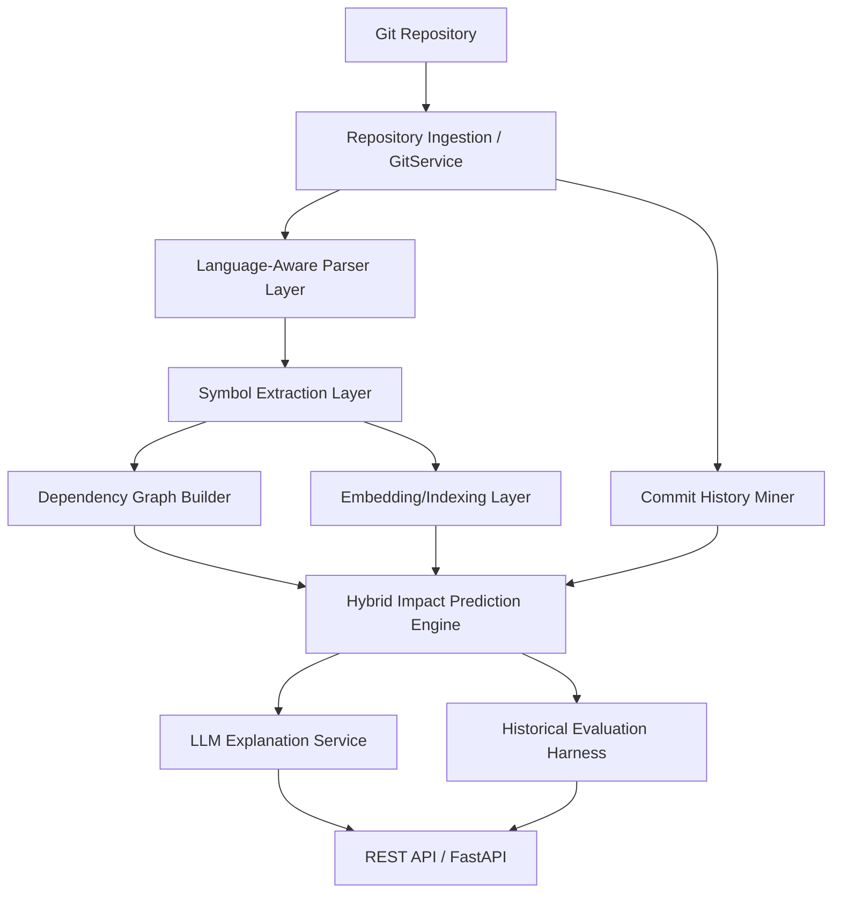

# System Architecture

RepoLens is built with a decoupled architecture separating deterministic static analysis, relational modeling, vector semantic search, and the LLM generation layer.

## Core Layers

### 1. Ingestion Layer (`GitService`)
Handles cloning and checking out refs, listing tracked files, extracting diffs, and querying git logs. Uses GitPython.

### 2. Language-Aware Parsers
- **Python**: Uses standard library `ast` package to parse modules into imports, classes, functions, and call structures.
- **JS/TS**: Uses `tree-sitter` for syntactic analysis, ensuring robust parsing of ES imports, CommonJS requires, and export structures.

### 3. Dependency Graph & Symbol Resolution
An in-memory `NetworkX` graph represents paths and dependencies. Relations are persisted in PostgreSQL, mapping source code files to call/import hierarchies.

### 4. Embedding Layer
Generates code-chunk-level embeddings (e.g., using `jinaai/jina-embeddings-v2-base-code`) and stores them in PostgreSQL with `pgvector` to enable semantic similarity searches.

### 5. Prediction Engine
Scores impacted files using a weighted linear combination:
- **Dependency Score**: Decay-based path distances in the static dependency graph.
- **Semantic Score**: Vector similarity between the change query and codebase chunks.
- **Co-change Score**: Historical probability of joint updates from commit mining.
- **Test Score**: Direct usage and naming conventions mapping tests to source files.
- **Risk Score**: Node centrality, churn frequency, and complexity heuristics.

### 6. LLM Explanation Layer
Only acts as a translator to convert structured impact data into clear summaries. Uses NVIDIA NIM APIs, failing back to deterministic summaries if unavailable.
